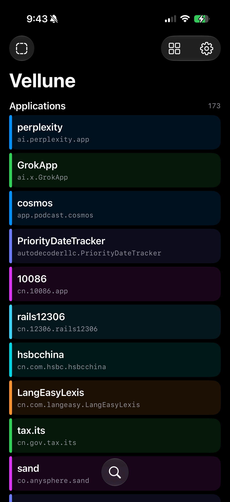

<p align="center">
  
</p>

<h1 align="center">Vellune</h1>

<p align="center">
  English · <a href="README.zh-CN.md">简体中文</a>
</p>

<p align="center">
  A native container explorer and guarded file workspace for iPhone and iPad,<br>
  built around the <a href="https://github.com/forcequitOS/bad_query"><code>bad_query</code></a> sandbox escape.
</p>

<p align="center">
  <a href="https://xnu.app/vellune/">Website</a> ·
  <a href="#compatibility">Compatibility</a> ·
  <a href="#building">Build</a> ·
  <a href="#acknowledgements">Acknowledgements</a>
</p>

> [!IMPORTANT]
> **Supported versions: iOS / iPadOS 26 through 27 beta 3.** The complete
> `bad_query` access path has been validated on a physical iPad Air running
> **iPadOS 27 beta 3 (`24A5380l`)**. A physical device is required; Simulator
> builds validate only compilation and UI. The upstream proof of concept lists
> support through iOS 26.6.1 and iOS 27 beta 4, but those additional versions
> have not all been validated in Vellune.

<table>
  <tr>
    <td width="68%"></td>
    <td width="32%"></td>
  </tr>
</table>

## What is Vellune?

Vellune turns the `bad_query` proof of concept into a focused file-exploration
interface for the iOS and iPadOS versions where the technique applies. It
discovers otherwise inaccessible containers, resolves their identifiers, and
lets you inspect, export, and deliberately replace individual files with a
verified backup and restore path.

The name **Vellune** is an invented word inspired by **veil** and **lune**
(French for “moon”). Its intended image is *looking through a veil at what was
previously hidden*—a fitting metaphor for exploring data beyond an app's normal
sandbox boundary.

## Highlights

- Native SwiftUI interface that adapts to iPad and iPhone.
- Opens on an App library that can switch between a visual grid and a compact
  list, with the selected layout remembered across launches.
- Indexes Application, App Group, PluginKit, Internal Daemon, System Data, and
  System Group containers.
- Resolves container UUIDs to readable bundle identifiers using container
  metadata.
- Falls back to `fsgetpath` inode discovery when a container root cannot be
  opened directly.
- Acquires a sandbox extension for each operation and releases it immediately
  afterward.
- Browses with directory history, back/forward/up navigation, local filtering,
  recursive container search, and name/date/size sorting.
- Previews searchable plist and JSON trees, XML, text, images, hexadecimal data,
  and Mach-O architecture, dependency, signature, and entitlement details.
- Opens an app-specific iPad workspace with the current file list beside file
  properties, then a resizable 60–90% preview that can expand full screen.
- Uses a focused push flow on iPhone: App library, file list, then full-screen
  preview, with file information presented separately.
- Shows file metadata and SHA-256 hashes before export.
- Prepares files on demand for sharing, streaming large copies in 1 MiB chunks
  with progress, cancellation, verification, and automatic cache expiry.
- Archives the current folder or a selected folder as ZIP while preserving empty
  directories, honoring the hidden-file setting, and skipping symbolic links.
- Provides familiar multi-select file operations: copy, cut, paste, duplicate,
  batch ZIP compression, ZIP/IPA extraction, and guarded deletion. Deletes first
  create a uniquely named recoverable safety archive. Batch operations report
  per-item failures and preserve failed selections or cut sources for retry.
- Extracts stored and Deflate ZIP entries with bounded streaming I/O. Extraction
  verifies paths, sizes, and CRC-32, checks free space, rejects encrypted links,
  oversized output, and suspicious expansion ratios, and cleans partial output
  when cancelled.
- Exports a complete Application data backup containing `Documents`, `Library`,
  `tmp`, and `manifest.json`. Every file is recorded with its SHA-256 digest.
- Restores complete App backups only after validating the bundle identifier,
  exact root structure, declared payload, file sizes, and every SHA-256. A newly
  created backup is extracted and verified before success is reported. Restore
  blocks Vellune's own live container, checks staging space, and first preserves the
  current container as a safety backup, stages the replacement, and rolls back
  if the directory swap fails.
- Exports the current directory as Markdown, with optional recursive traversal.
- Keeps browsing read-only by default while allowing guarded JSON and plist
  edits, versioned backup and replacement, SHA-256 verification, and restore
  with a fresh safety backup.
- Includes an on-device diagnostics suite with a structured JSON report.

## Compatibility

Vellune's stated support range is intentionally limited to versions covered by
its implementation and testing. **Do not assume that a newer beta or release is
compatible solely because the app builds.** Run the on-device self-test after
installing Vellune; private Container Manager behavior may change between OS
builds.

| Platform | Target | Validation |
| --- | --- | --- |
| iPadOS | 27 beta 3 (`24A5380l`) | Fully tested on physical iPad Air (`iPad15,3`) |
| iOS / iPadOS | 26.x | Deployment target and App Group compatibility path |
| iPhone | 27 beta 3 (`24A5390f`) | Fully tested on physical iPhone 17 Pro (`iPhone18,1`) |
| Simulator | 26–27 | UI only; `bad_query` requires a physical device |

The upstream project currently describes support through iOS 26.6.1 and iOS
27 beta 4. Vellune deliberately documents the narrower range that has been
implemented and validated here: **iOS/iPadOS 26 through 27 beta 3**. Versions
outside this range are unsupported until confirmed by physical-device testing.

### Physical-device diagnostics

Vellune includes an on-device regression suite that verifies sandbox access,
container discovery, structured preview, file analysis, Mach-O parsing,
streamed sharing, ZIP policy, stored and Deflate extraction, multi-item file
operations, cancellation cleanup, Markdown export, guarded editing, complete
App backup and rollback-safe restore, and local search. Results are written to
`Documents/vellune-self-test.json` inside Vellune's own data container. Container
counts are intentionally not presented as project-wide metrics because they
depend entirely on the apps and system state of each device.

## Building

### Requirements

- Xcode 27 beta
- iOS or iPadOS 26.0 or newer
- An Apple development team for device signing
- A physical device for testing sandbox access

### Steps

1. Clone the repository:

   ```sh
   git clone https://github.com/everettjf/vellune.git
   cd vellune
   ```

2. Open `Vellune.xcodeproj`.
3. Select the `Vellune` scheme and an iPhone or iPad destination.
4. Choose your development team under **Signing & Capabilities**.
5. Build and run.

Vellune uses the App Group identifier `group.com.eevv.Vellune` for the iOS 26
App Group access path. If you build under a different bundle identifier or
team, replace it with an App Group owned by your account in both
`Vellune/Vellune.entitlements` and `Vellune/Core/BadQueryClient.swift`.

## Project structure

```text
Vellune.xcodeproj/          Xcode project
Vellune/
  BadQuery/                 C bridge and sandbox-extension primitive
  Containers/               Container indexing and metadata resolution
  Core/                     File access, preview, and export
  Diagnostics/              On-device regression suite
  Model/                    Observable application state
  ContentView.swift         Adaptive iPad/iPhone interface
docs/                       GitHub Pages website
```

## Safety and scope

Vellune is experimental security-research software. It relies on private APIs
and behavior that can differ between OS builds. Use it only on devices and data
you own or are explicitly authorized to test.

Browsing, previews, search, and export remain read-only. Write operations require
an explicit user action. Structured edits use a temporary draft, validation,
Version Vault history, and SHA-256 verification. File deletion first creates a
recoverable ZIP; operation safety archives are retained for up to 30 days with
at most 10 archives in each category. Complete App restore validates the manifest and every payload
hash, saves the current `Documents`, `Library`, and `tmp`, stages the replacement,
then performs a rollback-capable directory swap. This is still sensitive research
software; an in-app backup reduces risk but is not a substitute for a device
backup. Diagnostics report failures explicitly instead of assuming a path is
accessible.

## Acknowledgements

Vellune exists because of the original
[`forcequitOS/bad_query`](https://github.com/forcequitOS/bad_query) sandbox
escape proof of concept. Thank you to **forcequitOS** and the project's
contributors for researching the issue and publishing a clear implementation
for the community.

The low-level container-query approach in Vellune is derived from that work.
Please credit and support the upstream project when reusing or extending it.

## Licensing status

The upstream `bad_query` repository does not currently declare an open-source
license. Consequently, the derived files under `Vellune/BadQuery/` are **not**
implicitly covered by a permissive license, and this repository intentionally
does not claim otherwise.

Before assigning a single open-source license to the complete repository,
obtain permission or a license clarification from the upstream author. The
remaining original Vellune code can be licensed separately once that boundary
is documented explicitly.

## Disclaimer

This project is provided for research and development. There is no warranty of
compatibility, reliability, or fitness for a particular purpose. Apple can
change or remove the private behavior Vellune depends on at any time.
